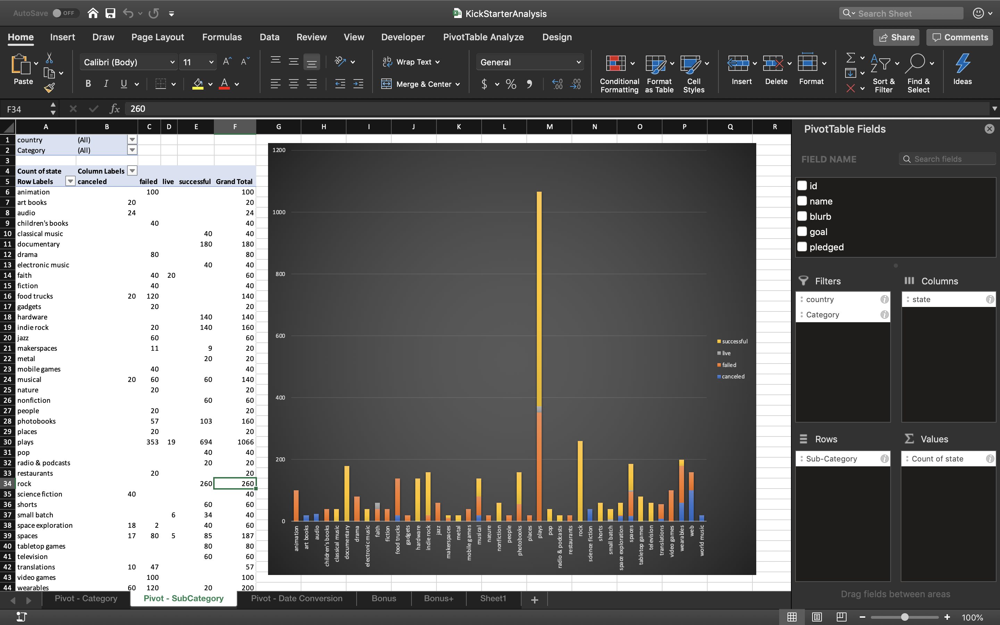
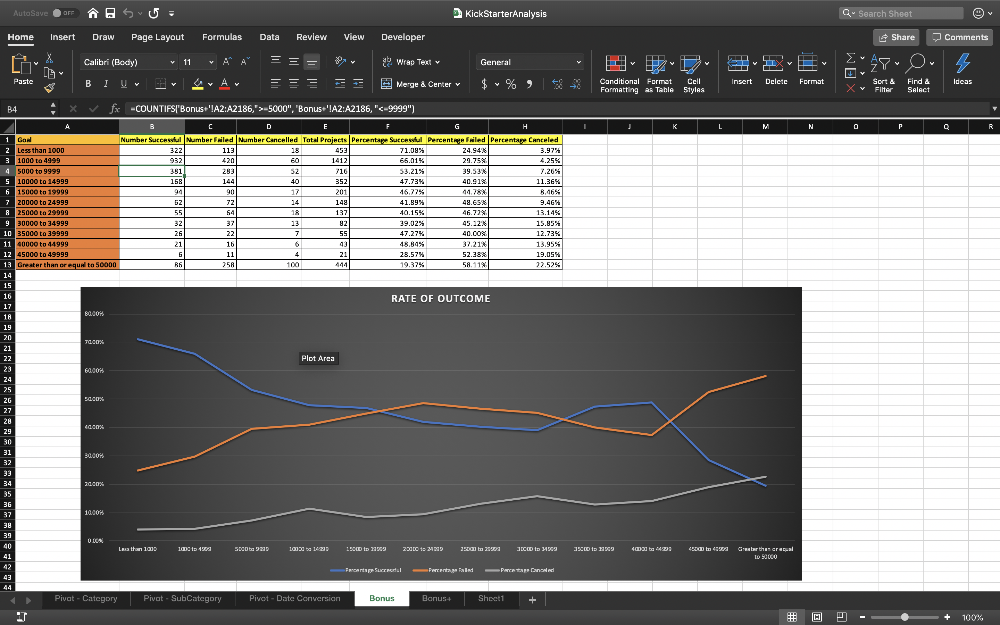

# Project Preview

This project uses Big Data to determine the successfulness of a Kickstarter program. Once cleaned and processed through advanced excel techniques, the data shows results regarding genres that outperformed others, locations of popularity, types of entertainment that towers above others, and dates that imply higher freedom and expenditure for the program. Alongside the project is an analytical essay explaining what the data tends to suggest.
-----------------------------------------------------------------------------------------------------------

-----------------------------------------------------------------------------------------------------------

-----------------------------------------------------------------------------------------------------------

-----------------------------------------------------------------------------------------------------------
